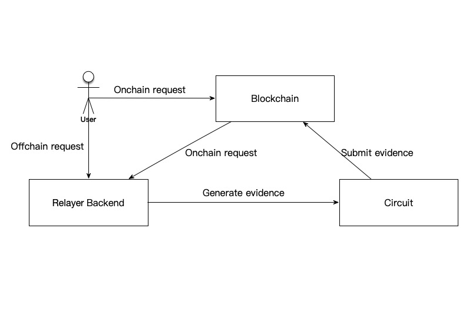

# Loopring

##Protocol & Exchange

**Loopring** is the first scalable DEX protocol built with zkRollup for Etheruem. Using Loopring, people can build a high-performance, orderbook-based, decentralized exchanges that do not take custody of users' crypto-assets. Due to the use of zkRollup, a layer-2 scalability solution, Loopring is capable of settling more than 2,000 trades per second on Ethereum 1.0. If you would like to learn more about Loopring's design and technical details, please check out Loopring's official website: [https://loopring.org](https://loopring.org).

**Loopring Exchange** is the first decentralized trading platform built on top of the Loopring protocol. Loopring Exchange is accessible at [Loopring.io](https://loopring.io). The current version of Loopring Exchange is beta1, which uses Loopring version 3.1.1. Loopring Exchange's contract address on Ethereum mainnet is: [`0x944644Ea989Ec64c2Ab9eF341D383cEf586A5777`](https://etherscan.io/address/beta1.loopringio.eth). The address has a permanent ENS as [`beta1.loopringio.eth`](https://etherscan.io/address/beta1.loopringio.eth).

## Technical Advantages

Loopring makes sure nobody can misappropriate users' crypto-assets deposited to an exchange. Even under extreme circumstances, such as an exchange's UI stopped functioning, or the exchange's operators are out of reach, users can still claim their rightful assets by providing valid Merkle proofs that are derivable from data on Ethereum.

Loopring does not guarantee the efficiency and fairness of off-chain order-matching. Order-matching is a job for the relayer system, which is a centralized piece of the overall DEX solution. Different exchanges built on the same Loopring protocol can adopt very different relayer solutions and thus provide various quality of services. The Loopring protocol does guarantee that relayers must follow specific rules for trade settlement.

We developed Loopring Exchange's relayer system as a closed source project. As of now, it offers a throughput of 200 trades per second..

## Overall Architecture

The overall architecture of Loopring Exchange is shown below:

Some key points you need to know:

- Loopring Exchange provides APIs to handle user offchain requests, namely order submission and cancellation, and withdrawals. Other user requests, including account registration, password reset, and deposits, must be submitted using Ethereum transactions. These requests are called on-chain requests.
- Loopring offers a high-performance trading experience similar to centralized exchanges, which mainly benefits from the batch processing capability of the underlying Loopring protocol. Loopring uses Ethereum as a data availability layer and a ZKP verification layer; Loopring does not perform trading related computations on Ethereum.